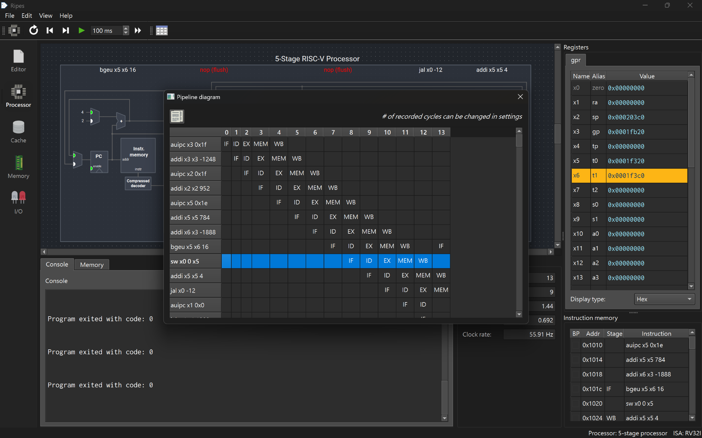
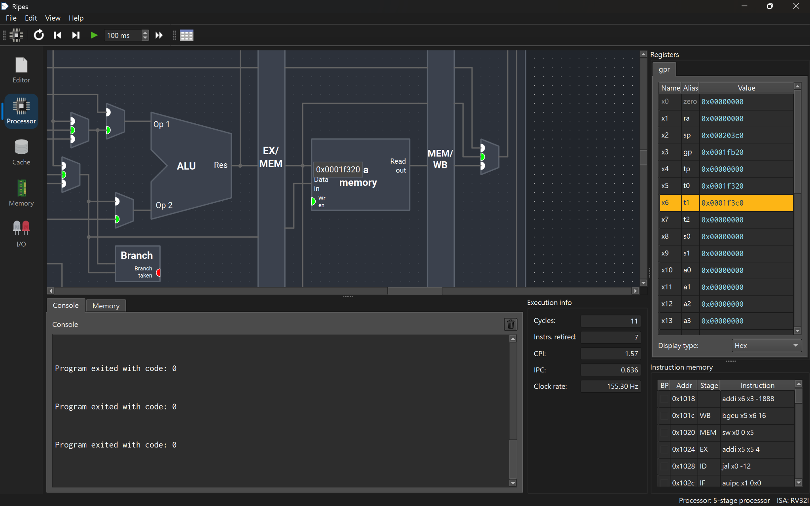
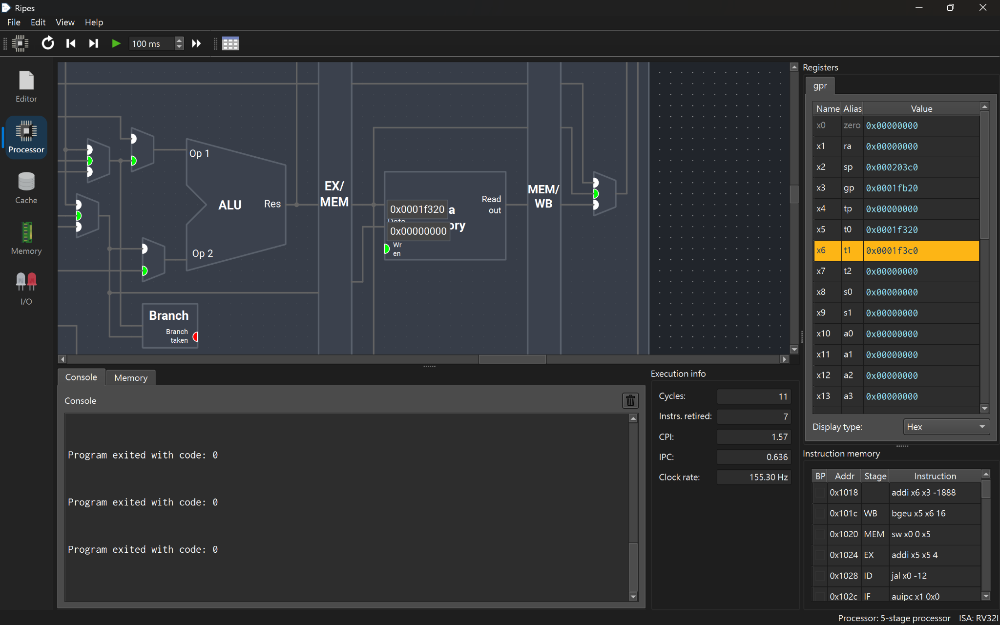
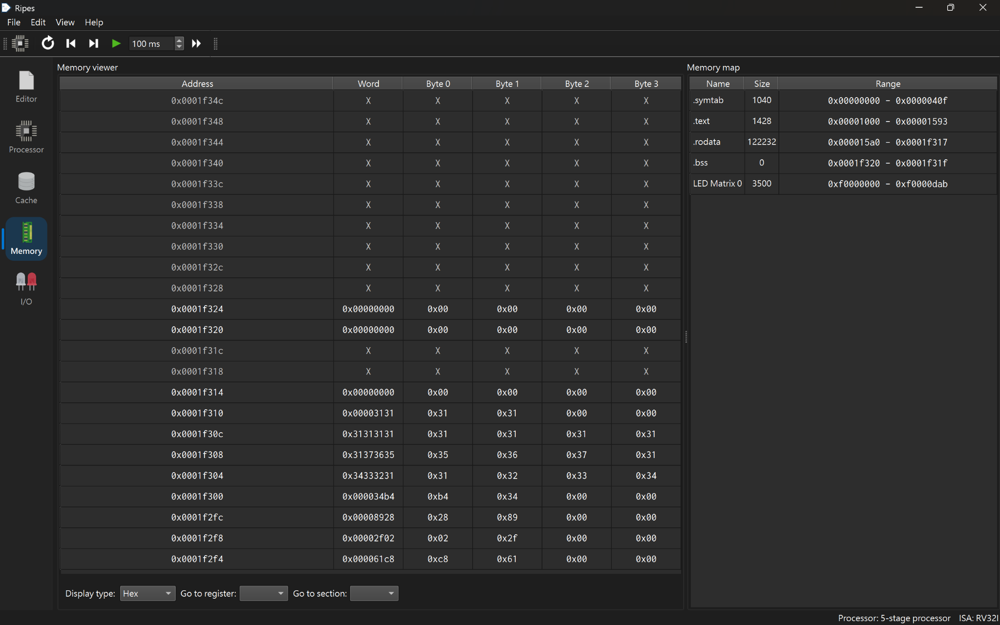
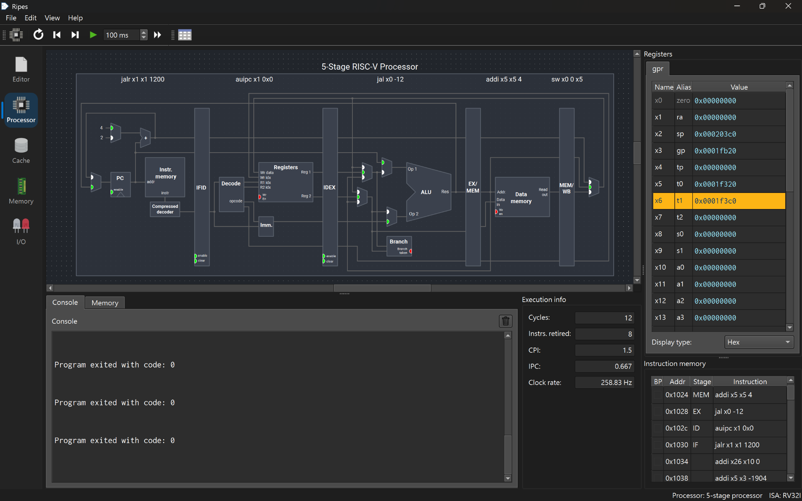
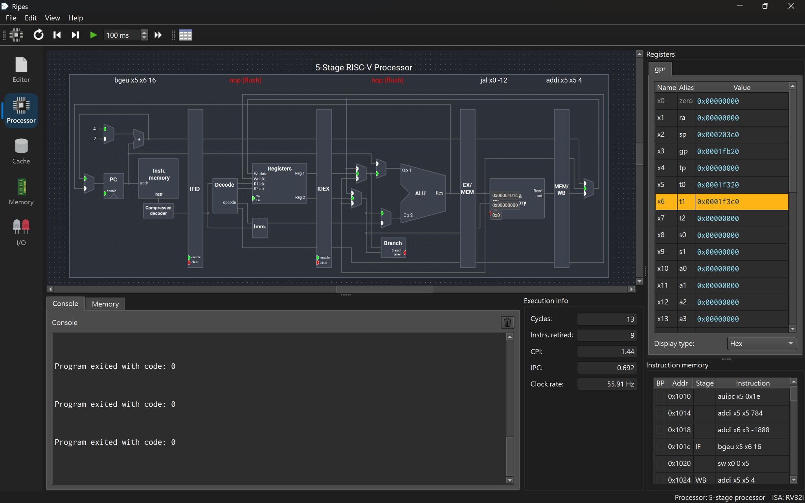
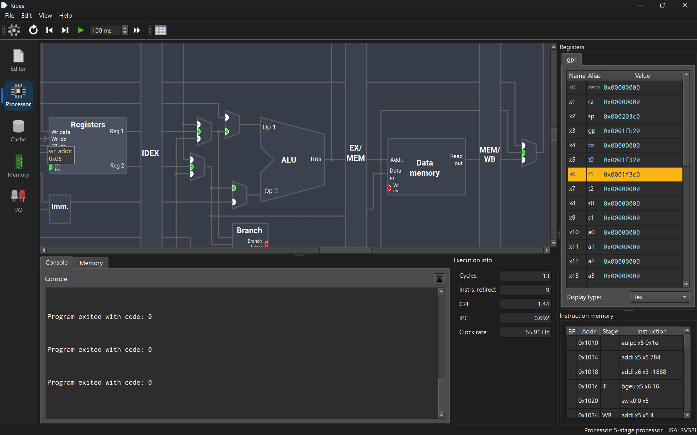
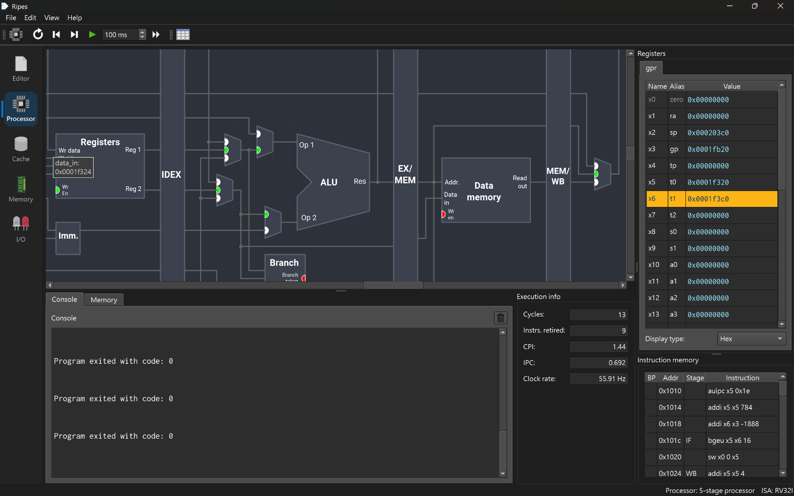

# RV32I pipeline walkthrough: workspace initialization

Date: October 7, 2026 (Asia/Taipei).

The program used in this walkthrough is `solved-cli.elf`, built with
`python3 rv32/led/build.py --delay 3000000` in the user's WSL repository.
The LED stage was committed as `c7cf1ab` on `stage5/led`, following the
solver validation commit `4b5ec97`. The CLI build has rendering disabled;
the delay setting therefore does not affect the instructions examined here.
The recorded setup is Windows Ripes `v2.2.6-106-g5b8a616`, using the
**5-stage processor** (`RV32_5S`) with forwarding and hazard detection,
RV32I only (M and C unchecked), and the Standard layout.
The processor/ISA and individual cycle counts are visible in the screenshots;
the version comes from the established installation record.

## Program behavior

The startup code initializes `gp` and `sp`, clears the solver's static
workspace, and calls `target_main`. The target parses the input, solves the
cube, and replays the returned path to check that it reaches the solved state.
The startup code then exposes the status in x26, the solution length in x27,
and the completion marker `0x600d` in x25 before exiting.

This walkthrough examines the workspace initialization loop in
[`rv32/start.S`](../../../../start.S), which is executed before the solver:

```asm
1:
    bgeu t0, t1, 2f
    sw zero, 0(t0)
    addi t0, t0, 4
    j 1b
```

Here t0 is x5, the current word address, and t1 is x6, the exclusive end
address. The startup code loads them from `__bss_start` and
`__bss_zero_end`. In the captured execution they are `0x1f320` and
`0x1f3c0`. The loop checks the bound before each store and advances the
address by four bytes. Thus it initializes the aligned workspace words in
`[0x1f320, 0x1f3c0)` (160 bytes for this CLI artifact), while leaving the
reserved stack outside the clearing loop. These addresses belong to this
build; the source uses linker symbols rather than hard-coded addresses.
This range is not the total static memory footprint.

## One store through IF, ID, EX, MEM, and WB

The selected instruction is at `0x1020`. Ripes displays it as
`sw x0 0 x5`, equivalent to `sw x0, 0(x5)`. The stage table records:

| Cycle | Stage | Instruction-level operation |
|---:|---|---|
| 8 | IF | Fetch the store instruction at `0x1020`. |
| 9 | ID | Decode the S-type store, read rs1=x5 and rs2=x0, and prepare the signed offset 0. |
| 10 | EX | The ALU computes the effective address rs1+offset, which is `0x1f320`. The base comes from the register operand path and the offset from the immediate path. |
| 11 | MEM | The saved address and store data reach Data memory; the write-enable signal is asserted. |
| 12 | WB | The store reaches the final pipeline stage without writing a general-purpose register. Its memory write belongs to MEM. |

The IF/ID, ID/EX, EX/MEM, and MEM/WB pipeline registers separate the
stages. They retain the information required by an older instruction while
younger instructions proceed behind it. In particular, when the following
`addi x5, x5, 4` is in EX, the store in MEM still uses the address already
carried through EX/MEM; it does not take a new address from the younger addi.



The stage history was recorded with Clock operations from Reset. Ripes'
fast Run operation does not record the history used by the stage table.
The cycle numbers above are the labels shown by this Ripes run, starting
with the first instruction in IF at cycle 0.

## Memory write signals and result

The cycle-11 screenshots show the store in MEM and the following signals:

| Data memory port | Observed value | Meaning |
|---|---|---|
| Addr | `0x0001f320` | Address computed for `sw x0, 0(x5)`. |
| Data in | `0x00000000` | The store source is x0, which reads as zero. |
| Wr en | `0x1` | The memory write is enabled. |






The next clock moves the store to WB and performs its MEM-stage write.
The memory-view screenshot taken after that instructed step shows the word
at `0x1f320` as `0x00000000`, with Byte 0 through Byte 3 all equal to
`0x00`. The write covers addresses `0x1f320` through `0x1f323`.
The memory-view tab itself does not show a cycle counter, so its timing is
based on the recorded manual sequence, rather than an independently visible
cycle label.



This confirms the write controls and the observed result. No before-store
memory screenshot was captured, so the evidence does not establish a
nonzero-to-zero transition. An already-zero word would have the same final
value. Adjacent words visible in the screenshot are not attributed to this
single four-byte store.

The memory map's displayed `.bss` section size is not used as a memory-budget
measurement here. The loop is explained from the source's linker symbols,
the observed t0/t1 values, and the store signals. Static-memory accounting
belongs to the separate ELF/build audit.

## Control flow and pipeline flush

At cycle 12, five instructions occupy the pipeline:

| Stage | Instruction |
|---|---|
| IF | `jalr x1, x1, 1200` at `0x1030` |
| ID | `auipc x1, 0` at `0x102c` |
| EX | `jal x0, -12` at `0x1028` |
| MEM | `addi x5, x5, 4` at `0x1024` |
| WB | `sw x0, 0(x5)` at `0x1020` |



The source's `j 1b` is encoded as `jal x0, -12`. It jumps from `0x1028`
to `0x101c`, and discards the link value because its destination is x0.
The two younger instructions fetched along the sequential path must be
discarded when the jump redirects execution.

At cycle 13, IF contains the loop's `bgeu` at `0x101c`, while ID and EX
both show red `nop (flush)` entries. The older addi continues to WB and
the jump itself continues to MEM. This is a control-flow flush, rather
than a load-use stall or an explicit nop inserted in the source.



## Register write enable and WB multiplexer

At cycle 13, `addi x5, x5, 4` is in WB. The screenshots expose:

| Register-file port | Observed value | Meaning |
|---|---|---|
| Wr En (`wr_en`) | `0x1` | The register write is enabled. |
| Wr idx (`wr_addr`) | `0x05` | The destination is x5 (t0). |
| Wr data (`data_in`) | `0x0001f324` | The pending value is `0x1f320 + 4`. |

The WB multiplexer immediately after MEM/WB has a green dot on its middle
input in these screenshots. For the addi in WB, the selected value is the
carried ALU result, which reaches the register file as `0x1f324`. Ripes
uses green input dots to mark the selected multiplexer path; a numeric
selector encoding was not captured and is not inferred from the dot alone.
The control belongs to the instruction in WB even though the register-file
component is drawn near the ID stage.






The register list still shows x5=`0x1f320` in these cycle-13 screenshots.
That is consistent with the WB input preparing the update for the next
clock: the current architectural register value and the pending write data
are different observations. This capture does not include the following
clock's register-list update.

The addi's register write and the store's memory write illustrate distinct
controls: a store updates Data memory in MEM, while an addi selects its
ALU result for a register-file update in WB. Each control must travel with
the instruction it describes.

## Reproducing the captured sequence

1. Build from the same source using `python3 rv32/led/build.py --delay 3000000`.
   Copy `rv32/build/led/solved-cli.elf` to the Windows machine.
2. Select **5-stage processor**, disable M and C, and keep Standard layout.
   Load `solved-cli.elf` as ELF and Reset.
3. Use Clock until cycle 11. Show the Data memory address, input data, and
   write-enable port values. Hovering a port also exposes its name and value.
4. Clock once to cycle 12, then view Memory at `0x1f320`. Return to Processor.
5. Clock once to cycle 13. Capture the redirected IF instruction and the
   two `nop (flush)` stages. Open Show stage table to see the store's history.
6. Keep cycle 13 and expose the Registers component's write-enable,
   write-index, and write-data ports, together with the WB mux's selected input.

This reproduces the instruction-level demonstration. The separate three-case
end-to-end validation runs check completion, status, and solution length;
these startup screenshots alone do not establish solver correctness or
optimality, and they are not a new exhaustive gate.

## Sources and evidence

- Program fragment: `rv32/start.S` in the user's repository; no source code
  was changed by producing this evidence package.
- [Homework 1](https://hackmd.io/@sysprog/2026-arch-homework1),
  “Instruction-level walkthrough”. The local assignment snapshot consulted
  requests program behavior, signal visualization, all five stages, and
  memory-update explanation. The live page was unavailable to the retrieval
  tool during this packaging step; no claim is made about later page changes.
- [Ripes introduction](https://github.com/mortbopet/Ripes/blob/master/docs/introduction.md),
  for stage-table recording, port-value inspection, mux indicators, and flush
  display conventions.
- All ten PNG files are unchanged user screenshots. Their hashes are listed
  in `SHA256SUMS`. This text explains the observations and explicitly identifies
  the uncaptured before-store value and post-WB register update.

After integration, link this file or adapt its explanations into the Stage 4
section of the English HackMD report. Repository integration, the report
update, and pushing the work to GitHub remain separate steps.
